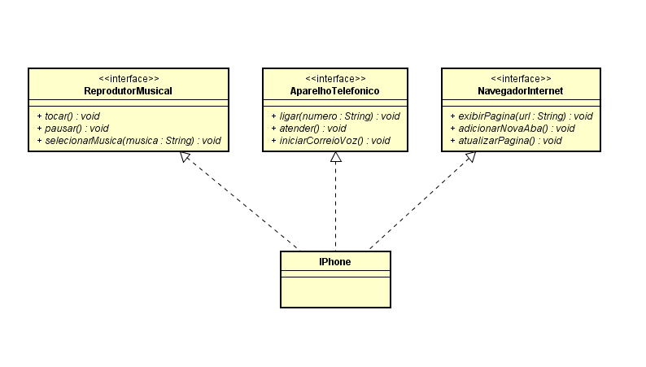

# Modelagem e Diagramação de um Componente iPhone

Neste desafio, foi modelado e diagramado a representação UML do componente iPhone, abrangendo suas funcionalidades como Reprodutor Musical, Aparelho Telefônico e Navegador na Internet.

## Funcionalidades modeladas

1. Reprodutor Musical
    - Métodos: <code>tocar()</code>, <code>pausar()</code>, <code>selecionarMusica(String musica)</code>
2. Aparelho Telefônico
    - Métodos: <code>ligar(String numero)</code>, <code>atender()</code>, <code>iniciarCorreioVoz()</code>
3. Navegador na Internet
    - Métodos: <code>exibirPagina(String url)</code>, <code>adicionarNovaAba()</code>, <code>atualizarPagina()</code>

## Diagrama UML

